# Give your Application Auto-Deploy Superpowers

In this project, you will prove your mastery of the following learning objectives:

- Explain the fundamentals and benefits of CI/CD to achieve, build, and deploy automation for cloud-based software products.
- Utilize Deployment Strategies to design and build CI/CD pipelines that support Continuous Delivery processes.
- Utilize a configuration management tool to accomplish deployment to cloud-based servers.
- Surface critical server errors for diagnosis using centralized structured logging.

## Project Submission

### 🔗 URLS
- **[URL01]**: <a href="https://github.com/Zeyad-Alo/Udapeople-AutoDeployed-WebApp">GitHub Repo</a>
- **[URL02]**: <a href="https://github.com/Zeyad-Alo/Udapeople-AutoDeployed-WebApp">S3 Bucket Public URL</a>

- **[URL03SCREENSHOT]**:
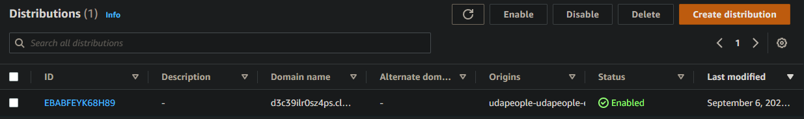

- **[URL04SCREENSHOT]**:
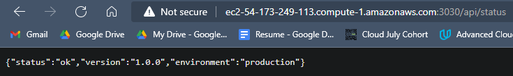

- **[URL05SCREENSHOT]**:

### SCREENSHOTS
 - **[SCREENSHOT01]**:
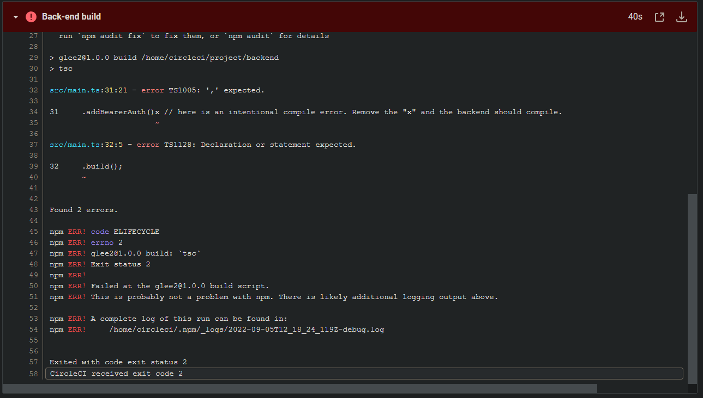

- **[SCREENSHOT02]**:
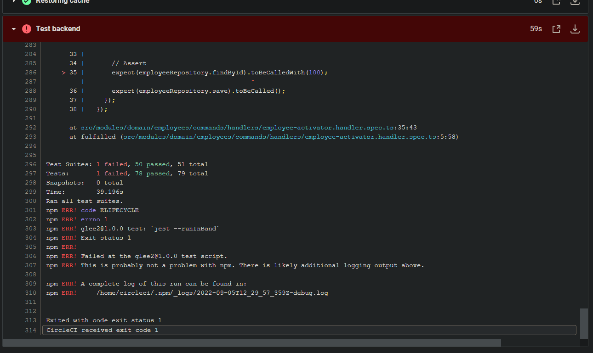

- **[SCREENSHOT03]**:
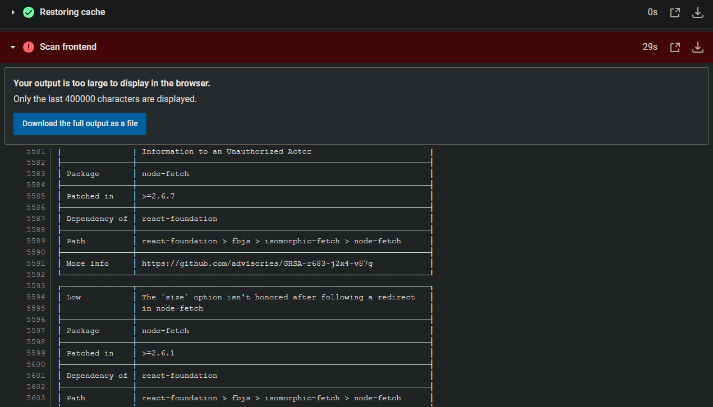

 - **[SCREENSHOT04]**:
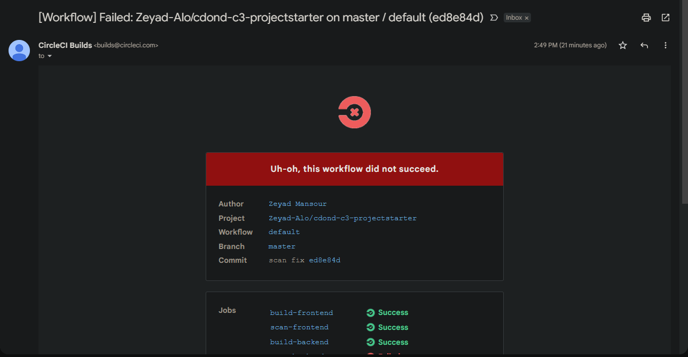

- **[SCREENSHOT05]**:
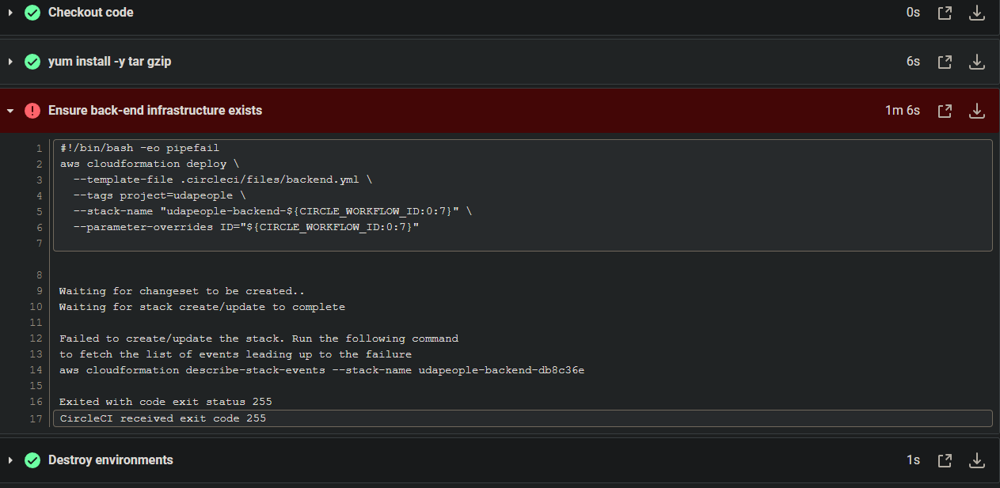

- **[SCREENSHOT06]**:
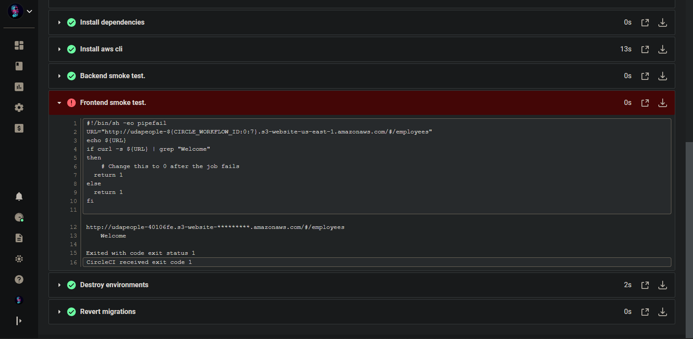

 - **[SCREENSHOT07]**:
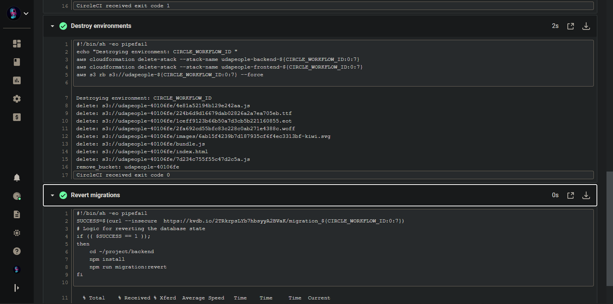

- **[SCREENSHOT08]**:
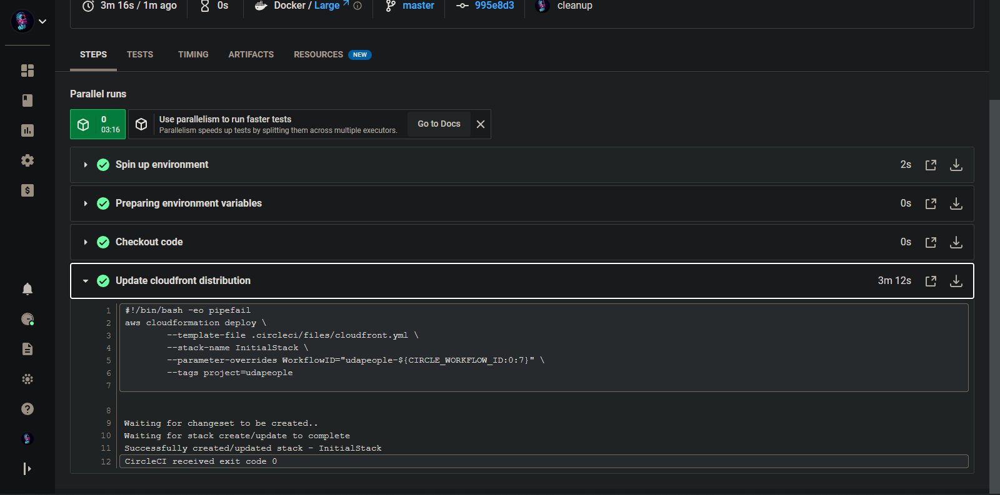

- **[SCREENSHOT09]**:
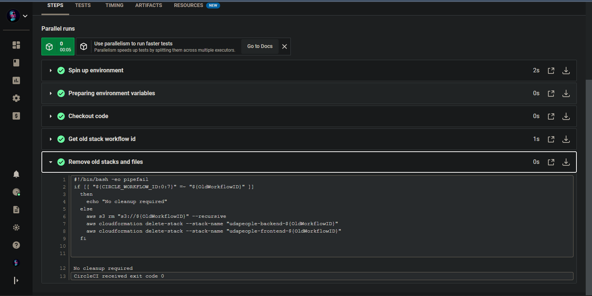

- **[SCREENSHOT10]**:
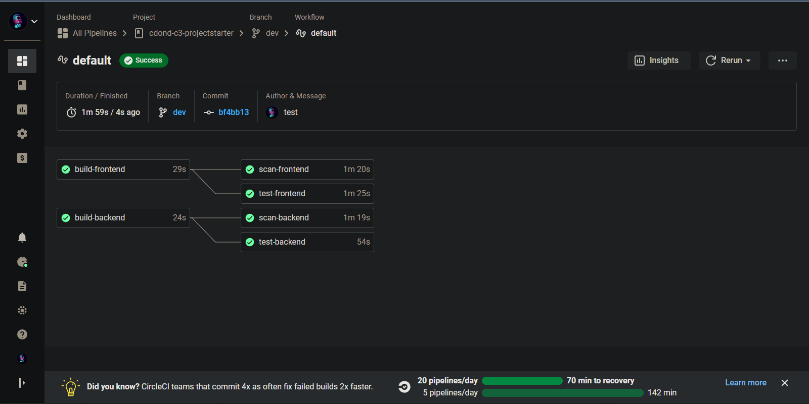

- **[SCREENSHOT11]**:
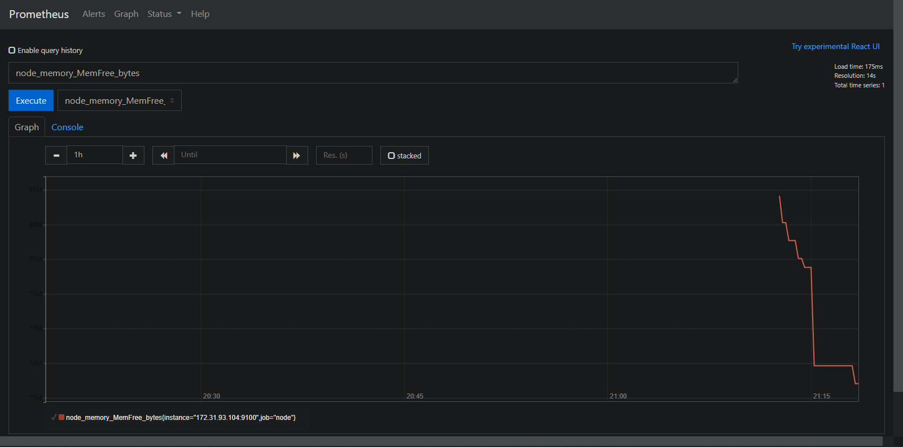
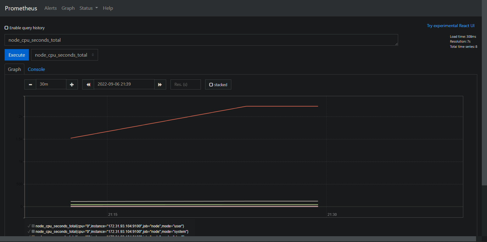
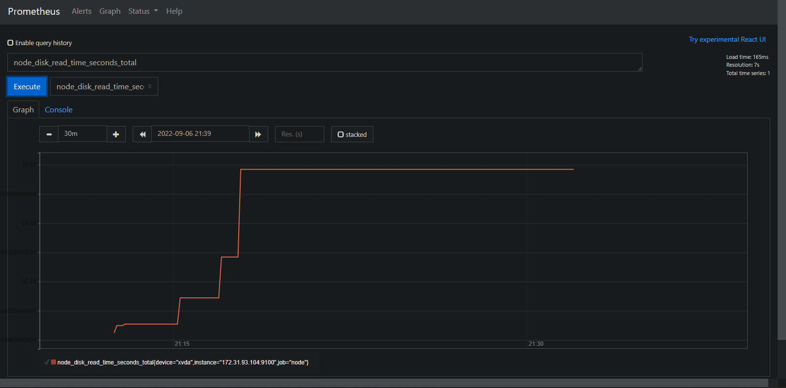

- **[SCREENSHOT12]**:
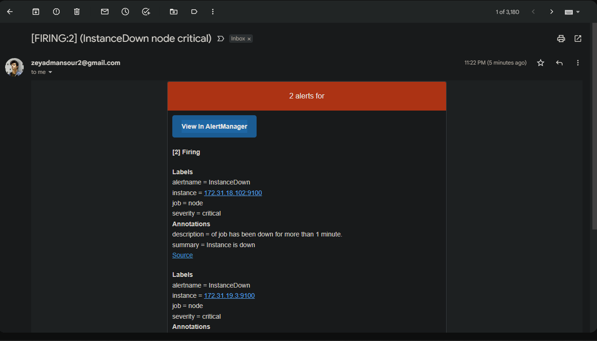

### [Presentation](presentation.pdf)

## Built With

- [Circle CI](www.circleci.com) - Cloud-based CI/CD service
- [Amazon AWS](https://aws.amazon.com/) - Cloud services
- [AWS CLI](https://aws.amazon.com/cli/) - Command-line tool for AWS
- [CloudFormation](https://aws.amazon.com/cloudformation/) - Infrastrcuture as code
- [Ansible](https://www.ansible.com/) - Configuration management tool
- [Prometheus](https://prometheus.io/) - Monitoring tool

### License

[License](LICENSE.md)
